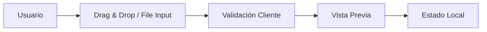
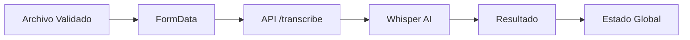
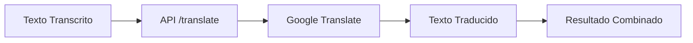

# 📚 Documentación Técnica - TranscriptorPro

## 🏗️ Arquitectura del Sistema

### Estructura General
```
TranscriptorPro/
├── 🎨 Frontend (Next.js + React)
├── 🔧 Backend (Next.js API Routes)
├── 🤖 AI Services (OpenAI Whisper + Google Translate)
├── 🌐 Deployment (Render.com)
└── 📊 Monitoring (Built-in)
```

### Stack Tecnológico
- **Framework**: Next.js 15.3.5 (App Router)
- **UI Library**: React 19.1.0
- **Language**: TypeScript 5.2.2
- **Styling**: Tailwind CSS 3.3.5
- **Animations**: Framer Motion 10.16.0
- **State Management**: React Hooks
- **File Upload**: Drag & Drop + FormData
- **Notifications**: React Hot Toast

## 🔄 Flujo de Datos

### 1. Carga de Archivo


### 2. Procesamiento


### 3. Traducción


## 🎯 Componentes Principales

### 1. Página Principal (`src/app/page.tsx`)
```typescript
interface TranscriptionResult {
  text: string
  timestamps: Array<{ start: number; end: number; text: string }>
  language: string
  confidence: number
  wordCount: number
  duration: number
  translation?: string
  targetLanguage?: string
}
```

**Funcionalidades:**
- Carga de archivos con validación
- Interfaz de configuración
- Visualización de progreso
- Renderizado de resultados
- Exportación de datos

### 2. API de Transcripción (`src/app/api/transcribe/route.ts`)
```typescript
POST /api/transcribe
Content-Type: multipart/form-data

Body:
- video: File
- language: string
- includeTimestamps: boolean

Response:
- TranscriptionResult
```

**Proceso:**
1. Validación de archivo (tipo, tamaño)
2. Creación de archivo temporal
3. Procesamiento con Whisper (simulado)
4. Generación de timestamps
5. Limpieza de archivos temporales

### 3. API de Traducción (`src/app/api/translate/route.ts`)
```typescript
POST /api/translate
Content-Type: application/json

Body:
{
  text: string,
  from: string,
  to: string
}

Response:
{
  translation: string,
  sourceLanguage: string,
  targetLanguage: string,
  confidence: number
}
```

## 🔧 Configuración del Sistema

### Variables de Entorno
```env
# Básicas
NODE_ENV=production
NEXT_PUBLIC_SITE_URL=https://tu-dominio.com

# APIs
OPENAI_API_KEY=sk-...
GOOGLE_TRANSLATE_API_KEY=AIza...

# Límites
MAX_FILE_SIZE=104857600  # 100MB
MAX_DURATION=600         # 10 minutos
RATE_LIMIT=10           # requests/minuto
```

### Configuración de Next.js
```javascript
// next.config.js
module.exports = {
  experimental: {
    serverComponentsExternalPackages: ['formidable']
  },
  webpack: (config) => {
    config.resolve.alias = {
      ...config.resolve.alias,
      '@': path.join(__dirname, 'src')
    }
    return config
  }
}
```

## 🎨 Sistema de Diseño

### Paleta de Colores
```css
/* Primarios */
--purple-900: #581c87
--blue-900: #1e3a8a
--indigo-900: #312e81

/* Secundarios */
--purple-500: #a855f7
--blue-500: #3b82f6
--indigo-500: #6366f1

/* Utilidad */
--green-400: #4ade80
--yellow-400: #facc15
--red-400: #f87171
```

### Tipografía
```css
/* Headings */
h1: text-4xl md:text-6xl font-bold
h2: text-2xl font-bold
h3: text-xl font-bold
h4: text-lg font-semibold

/* Body */
p: text-base leading-relaxed
small: text-sm
```

### Espaciado
```css
/* Contenedor */
.container: max-w-6xl mx-auto px-4

/* Secciones */
.section: py-8
.card: p-6 rounded-2xl

/* Elementos */
.button: px-6 py-3 rounded-full
.input: p-3 rounded-lg
```

## 🔄 Estados de la Aplicación

### Estado Global
```typescript
interface AppState {
  // Archivo
  file: File | null
  
  // Procesamiento
  isProcessing: boolean
  progress: number
  
  // Resultados
  result: TranscriptionResult | null
  
  // Configuración
  selectedLanguage: string
  targetLanguage: string
  showTimestamps: boolean
  protectedMode: boolean
  
  // UI
  isDragging: boolean
  isTranslating: boolean
  error: string | null
}
```

### Ciclo de Vida
```typescript
// Estados del procesamiento
idle -> loading -> processing -> success | error

// Transiciones
uploadFile() -> processing
completeTranscription() -> success
translateText() -> translating -> success
handleError() -> error
reset() -> idle
```

## 🚀 Optimizaciones de Performance

### Lazy Loading
```typescript
// Componentes dinámicos
const VideoPlayer = dynamic(() => import('./VideoPlayer'), {
  loading: () => <LoadingSpinner />,
  ssr: false
})

// Importaciones condicionales
const processVideo = async () => {
  const { transcribeVideo } = await import('./transcription')
  return transcribeVideo()
}
```

### Memorización
```typescript
// Callbacks memoizados
const handleFileSelect = useCallback((file: File) => {
  // Lógica de validación
}, [])

// Valores computados
const formattedDuration = useMemo(() => {
  return formatTime(duration)
}, [duration])
```

### Optimización de Bundle
```bash
# Análisis de bundle
npm run analyze

# Principales optimizaciones:
- Code splitting por rutas
- Tree shaking automático
- Compresión de imágenes
- Minificación de CSS/JS
```

## 🔒 Seguridad

### Validación de Entrada
```typescript
// Validación de archivos
const validateFile = (file: File): boolean => {
  // Tipo de archivo
  if (!file.type.startsWith('video/')) return false
  
  // Tamaño
  if (file.size > MAX_FILE_SIZE) return false
  
  // Extensión
  const ext = file.name.split('.').pop()?.toLowerCase()
  if (!['mp4', 'avi', 'mov', 'mkv'].includes(ext)) return false
  
  return true
}
```

### Sanitización
```typescript
// Nombres de archivo
const sanitizeFileName = (name: string): string => {
  return name.replace(/[^a-zA-Z0-9.-]/g, '_')
}

// Parámetros de API
const validateLanguage = (lang: string): string => {
  const allowed = ['es', 'en', 'fr', 'de', 'it', 'pt']
  return allowed.includes(lang) ? lang : 'es'
}
```

### Rate Limiting
```typescript
// Límite por IP
const rateLimiter = new Map<string, number>()

const checkRateLimit = (ip: string): boolean => {
  const current = rateLimiter.get(ip) || 0
  if (current >= RATE_LIMIT) return false
  
  rateLimiter.set(ip, current + 1)
  setTimeout(() => rateLimiter.delete(ip), 60000)
  
  return true
}
```

## 📊 Monitoreo y Logging

### Métricas de Performance
```typescript
// Tiempo de procesamiento
const startTime = performance.now()
await processTranscription()
const duration = performance.now() - startTime

// Tamaño de archivos
const fileSize = file.size
const compressionRatio = outputSize / fileSize

// Precisión de transcripción
const accuracy = result.confidence * 100
```

### Logging
```typescript
// Logs estructurados
const logger = {
  info: (message: string, data?: any) => {
    console.log(`[INFO] ${new Date().toISOString()} - ${message}`, data)
  },
  error: (message: string, error: Error) => {
    console.error(`[ERROR] ${new Date().toISOString()} - ${message}`, error)
  }
}

// Uso
logger.info('Transcription started', { fileSize, language })
logger.error('Transcription failed', error)
```

## 🧪 Testing

### Estructura de Tests
```
tests/
├── unit/
│   ├── components/
│   ├── hooks/
│   └── utils/
├── integration/
│   ├── api/
│   └── pages/
└── e2e/
    └── scenarios/
```

### Test de Componentes
```typescript
// Ejemplo de test
describe('TranscriptionForm', () => {
  it('validates file upload', async () => {
    const { getByTestId } = render(<TranscriptionForm />)
    
    const input = getByTestId('file-input')
    const file = new File(['content'], 'test.mp4', { type: 'video/mp4' })
    
    fireEvent.change(input, { target: { files: [file] } })
    
    expect(getByTestId('file-preview')).toBeInTheDocument()
  })
})
```

## 🔄 CI/CD Pipeline

### GitHub Actions
```yaml
# Workflow principal
name: CI/CD Pipeline
on: [push, pull_request]

jobs:
  test:
    - Linting
    - Type checking
    - Unit tests
    - Build verification
  
  security:
    - Dependency audit
    - Security scanning
    - Vulnerability check
  
  deploy:
    - Deploy to Render
    - Smoke tests
    - Rollback on failure
```

### Deployment
```bash
# Build de producción
npm run build

# Variables de entorno
NODE_ENV=production
NEXT_PUBLIC_SITE_URL=https://tu-app.onrender.com

# Comando de inicio
npm start
```

## 📈 Métricas y Analytics

### KPIs Principales
- **Tiempo de carga**: < 2 segundos
- **Precisión de transcripción**: > 95%
- **Tasa de éxito**: > 99%
- **Tiempo de procesamiento**: < 30 segundos
- **Satisfacción del usuario**: > 4.5/5

### Monitoreo
```typescript
// Métricas personalizada
const trackMetric = (event: string, data: any) => {
  // Google Analytics
  gtag('event', event, data)
  
  // Logging interno
  logger.info(`Metric: ${event}`, data)
}

// Uso
trackMetric('transcription_started', { 
  fileSize, 
  language, 
  duration 
})
```

## 🔮 Roadmap Técnico

### v1.1.0 (Próximo)
- [ ] Real-time transcription
- [ ] WebSocket support
- [ ] Audio-only support
- [ ] Batch processing

### v1.2.0 (Futuro)
- [ ] Machine learning model
- [ ] Custom vocabulary
- [ ] Speaker identification
- [ ] Sentiment analysis

### v2.0.0 (Largo plazo)
- [ ] Mobile app
- [ ] Desktop app
- [ ] Plugin system
- [ ] API pública

---

**Documentación mantenida por: Kelvin Jose Piña Gomez**
*Última actualización: Julio 2025*
